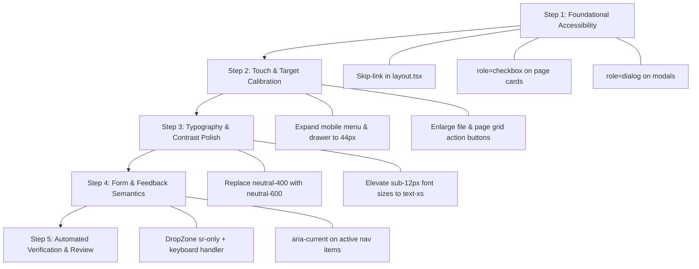

# PDFella — Comprehensive UI/UX & Accessibility Audit

**Audit Date:** September 2026  
**Auditor Engine:** `ui-ux-pro-max` (WCAG 2.2 AA / AAA, Apple Human Interface Guidelines, Material Design 3, Next.js 16)  
**Target Application:** PDFella ([pdfx.tharidulakmal.com](https://pdfella.tharidulakmal.com))  
**Product Category:** 100% Client-Side Private PDF Utility Suite  
**Technology Stack:** Next.js 16 (App Router), React 19, Tailwind CSS 4, Framer Motion, @dnd-kit, pdf-lib, pdfjs-dist  

---

## 1. Executive Summary & Health Scores

| Dimension | Score | Status | Key Observations |
| :--- | :---: | :---: | :--- |
| **Accessibility (WCAG 2.2 AA)** | **68 / 100** | ⚠️ Needs Remediation | Lacks a skip-link; several interactive page cards rely on non-semantic `<div onClick>` without keyboard support or ARIA roles; icon buttons use `title` instead of `aria-label`. |
| **Touch & Interaction (Apple HIG / MD3)** | **72 / 100** | ⚠️ Action Required | Several touch targets (mobile hamburger menu, sidebar close, pagination buttons, rotation buttons, color selectors) are under the 44×44px minimum target size. |
| **Visual Hierarchy & Design Cohesion** | **91 / 100** |  Excellent | Consistent burgundy branding (`#800020`), clean card surfaces, strict vector icons (100% SVG via Lucide/Heroicons, zero emojis). |
| **Layout & Responsive Adaptability** | **88 / 100** |  Good | Fluid layout, responsive sidebar drawer, good breakpoint adaptability. Needs `<main id="main-content">` landmark elevation. |
| **Performance (Next.js 16)** | **92 / 100** |  Excellent | 100% client-side privacy architecture, dynamic imports (`next/dynamic`) for heavy canvas and PDF renderers, `next/font` integration. |
| **Forms, Controls & User Feedback** | **84 / 100** |  Good | Real-time toasts via Sonner, clear file headers. Form controls need explicit `htmlFor` / `id` associations and `aria-describedby` helper text connections. |

---

## 2. Priority Audit Matrix

| Priority | Category | Severity | Primary Rule | File Reference | Finding Summary |
| :---: | :--- | :---: | :--- | :--- | :--- |
| **1** | **Accessibility** | **CRITICAL** | `skip-links` | [app/layout.tsx](file:///home/lkml/LKML/pdfx.tharidulakmal.com/app/layout.tsx#L118-L123) | No "Skip to main content" link for keyboard users. |
| **1** | **Accessibility** | **CRITICAL** | `keyboard-nav` / `aria-checked` | [SplitPdfView.tsx](file:///home/lkml/LKML/pdfx.tharidulakmal.com/components/features/pdf/SplitPdfView.tsx#L87-L95), [RemovePagesView.tsx](file:///home/lkml/LKML/pdfx.tharidulakmal.com/components/features/pdf/RemovePagesView.tsx#L97-L105) | Page cards are plain `<div onClick>` with no `role="checkbox"`, `tabIndex={0}`, or Space/Enter keys. |
| **1** | **Accessibility** | **HIGH** | `aria-labels` | [PdfViewerToolbar.tsx](file:///home/lkml/LKML/pdfx.tharidulakmal.com/components/features/pdf/signature/PdfViewerToolbar.tsx#L38-L92), [PlacementBox.tsx](file:///home/lkml/LKML/pdfx.tharidulakmal.com/components/features/pdf/signature/PlacementBox.tsx#L174-L185) | Icon buttons use `title` instead of explicit `aria-label` (pagination, zoom, delete). |
| **1** | **Accessibility** | **HIGH** | `dialog-semantics` | [SignaturePadModal.tsx](file:///home/lkml/LKML/pdfx.tharidulakmal.com/components/features/pdf/SignaturePadModal.tsx#L128-L135) | Modal container lacks `role="dialog"`, `aria-modal="true"`, and `aria-labelledby`. |
| **2** | **Touch & Interaction** | **CRITICAL** | `touch-target-size` | [Header.tsx](file:///home/lkml/LKML/pdfx.tharidulakmal.com/components/layout/Header/Header.tsx#L14-L20), [Sidebar.tsx](file:///home/lkml/LKML/pdfx.tharidulakmal.com/components/layout/Sidebar/Sidebar.tsx#L75-L81) | Mobile hamburger button (`w-9 h-9` = 36px) and drawer close button (`w-8 h-8` = 32px) are under 44×44px. |
| **2** | **Touch & Interaction** | **HIGH** | `touch-target-size` | [FileItem.tsx](file:///home/lkml/LKML/pdfx.tharidulakmal.com/components/features/pdf/FileItem.tsx#L86-L100), [OrganizePageGrid.tsx](file:///home/lkml/LKML/pdfx.tharidulakmal.com/components/features/pdf/OrganizePageGrid.tsx#L96-L140) | File reorder buttons (`w-7 h-7` = 28px) and rotation buttons (`p-1.5`) are too small for touch devices. |
| **2** | **Touch & Interaction** | **MEDIUM** | `dragging-alternative` | [PlacementBox.tsx](file:///home/lkml/LKML/pdfx.tharidulakmal.com/components/features/pdf/signature/PlacementBox.tsx#L189-L210) | Placed signature handles are pointer-only; keyboard navigation cannot nudge or resize placed signatures. |
| **5** | **Layout & Semantic** | **MEDIUM** | `landmark-roles` | [AppLayout.tsx](file:///home/lkml/LKML/pdfx.tharidulakmal.com/components/layout/AppLayout/AppLayout.tsx#L19-L25) | Root layout wraps page content in generic `<div>` without a clear `<main id="main-content">` landmark. |
| **6** | **Typography & Color** | **HIGH** | `color-contrast` | [Footer.tsx](file:///home/lkml/LKML/pdfx.tharidulakmal.com/components/layout/Footer/Footer.tsx#L18-L22), [MetadataPdfView.tsx](file:///home/lkml/LKML/pdfx.tharidulakmal.com/components/features/pdf/MetadataPdfView.tsx#L367-L370) | `text-[11px] text-neutral-400` on `#fafafa` has a contrast ratio of **~2.5:1** (fails WCAG AA 4.5:1 requirement). |
| **8** | **Forms & Feedback** | **MEDIUM** | `form-labels` | [WatermarkControls.tsx](file:///home/lkml/LKML/pdfx.tharidulakmal.com/components/features/pdf/watermark/WatermarkControls.tsx#L94-L101), [DropZone.tsx](file:///home/lkml/LKML/pdfx.tharidulakmal.com/components/features/pdf/DropZone.tsx#L111-L118) | Input fields lack explicit `htmlFor` / `id` pairings; file inputs use `hidden` instead of `sr-only`. |
| **9** | **Navigation** | **MEDIUM** | `nav-state-active` | [SidebarNavList.tsx](file:///home/lkml/LKML/pdfx.tharidulakmal.com/components/layout/Sidebar/SidebarNavList.tsx#L68-L94) | Active desktop nav item renders as a non-interactive `<div>` instead of a semantic `<Link aria-current="page">`. |

---

## 3. Detailed Audit Findings & Remediation

### 3.1 Priority 1: Accessibility (CRITICAL)

#### Issue 1.1: Missing "Skip to Main Content" Link
- **Standard:** WCAG 2.2 Level A (2.4.1 Bypass Blocks)
- **Rule ID:** `skip-links`
- **Location:** [app/layout.tsx](file:///home/lkml/LKML/pdfx.tharidulakmal.com/app/layout.tsx#L118-L123)
- **Problem:** Keyboard-only users tab through every navigation item on every page before reaching the primary tool action area.
- **Recommended Remediation:**
  Add a visually hidden, focus-revealed skip anchor at the top of `RootLayout`:
  ```tsx
  <body className={`min-h-full flex flex-col bg-white text-neutral-900 ${inter.className}`}>
    <a
      href="#main-content"
      className="sr-only focus:not-sr-only focus:fixed focus:top-4 focus:left-4 focus:z-50 focus:px-4 focus:py-2.5 focus:bg-brand-primary focus:text-white focus:font-semibold focus:rounded-xl focus:shadow-lg focus:ring-2 focus:ring-offset-2 focus:ring-brand-primary"
    >
      Skip to main content
    </a>
    {children}
    <Toaster />
  </body>
  ```
  Ensure [AppLayout.tsx](file:///home/lkml/LKML/pdfx.tharidulakmal.com/components/layout/AppLayout/AppLayout.tsx#L21-L24) wraps tool views in `<main id="main-content">`.

---

#### Issue 1.2: Interactive Page Cards Lack Keyboard & ARIA Roles
- **Standard:** WCAG 2.2 Level A (2.1.1 Keyboard, 4.1.2 Name, Role, Value)
- **Rule ID:** `keyboard-nav`, `aria-labels`
- **Locations:**
  - [components/features/pdf/SplitPdfView.tsx](file:///home/lkml/LKML/pdfx.tharidulakmal.com/components/features/pdf/SplitPdfView.tsx#L87-L95)
  - [components/features/pdf/RemovePagesView.tsx](file:///home/lkml/LKML/pdfx.tharidulakmal.com/components/features/pdf/RemovePagesView.tsx#L97-L105)
- **Problem:**
  ```tsx
  // Current:
  <div
    key={page.number}
    onClick={() => togglePage(page.number)}
    className={`relative rounded-xl p-3 ... cursor-pointer`}
  >
  ```
  Screen readers treat the card as plain static content. Keyboard users navigating with `Tab` skip over all pages.
- **Recommended Remediation:**
  ```tsx
  <div
    key={page.number}
    role="checkbox"
    aria-checked={page.selected}
    aria-label={`Page ${page.number}${page.selected ? ", selected" : ""}`}
    tabIndex={0}
    onClick={() => togglePage(page.number)}
    onKeyDown={(e) => {
      if (e.key === " " || e.key === "Enter") {
        e.preventDefault();
        togglePage(page.number);
      }
    }}
    className={`relative rounded-xl p-3 focus-visible:outline-none focus-visible:ring-2 focus-visible:ring-brand-primary focus-visible:ring-offset-2 cursor-pointer ...`}
  >
  ```

---

#### Issue 1.3: Modal Dialog Semantics & Dismiss Button
- **Standard:** WCAG 2.2 Level AA (1.3.1 Info and Relationships, 2.4.3 Focus Order)
- **Rule ID:** `modal-escape`, `aria-labels`
- **Location:** [components/features/pdf/SignaturePadModal.tsx](file:///home/lkml/LKML/pdfx.tharidulakmal.com/components/features/pdf/SignaturePadModal.tsx#L128-L144)
- **Problem:**
  The modal outer container does not specify `role="dialog"` or `aria-modal="true"`. The close button lacks an explicit `aria-label`.
- **Recommended Remediation:**
  ```tsx
  <div
    role="dialog"
    aria-modal="true"
    aria-labelledby="signature-dialog-title"
    className="w-full max-w-3xl overflow-hidden rounded-2xl bg-white shadow-lg border border-neutral-200"
  >
    <div className="flex items-center justify-between border-b border-neutral-200 px-6 py-4">
      <div>
        <h3 id="signature-dialog-title" className="text-lg font-bold text-neutral-900">
          Create Signature
        </h3>
        ...
      </div>
      <button
        type="button"
        onClick={onClose}
        aria-label="Close signature dialog"
        className="min-w-[44px] min-h-[44px] rounded-lg flex items-center justify-center text-neutral-500 hover:bg-neutral-100 hover:text-neutral-800 transition-colors cursor-pointer"
      >
        <HiXMark className="w-5 h-5" aria-hidden="true" />
      </button>
    </div>
  ```

---

### 3.2 Priority 2: Touch & Interaction Targets (CRITICAL)

#### Issue 2.1: Controls Below Minimum Target Size (44×44px)
- **Standard:** WCAG 2.2 Target Size Minimum (2.5.8), Apple HIG (44×44pt), Material Design 3 (48×48dp)
- **Rule ID:** `touch-target-size`
- **Affected Elements:**
  1. **Mobile Menu Toggle:** [Header.tsx](file:///home/lkml/LKML/pdfx.tharidulakmal.com/components/layout/Header/Header.tsx#L14) (`w-9 h-9` = 36px) → Expand container to `min-w-[44px] min-h-[44px]`.
  2. **Mobile Drawer Close:** [Sidebar.tsx](file:///home/lkml/LKML/pdfx.tharidulakmal.com/components/layout/Sidebar/Sidebar.tsx#L78) (`w-8 h-8` = 32px) → Expand container to `min-w-[44px] min-h-[44px]`.
  3. **File Move & Delete Buttons:** [FileItem.tsx](file:///home/lkml/LKML/pdfx.tharidulakmal.com/components/features/pdf/FileItem.tsx#L91-L115) (`w-7 h-7` = 28px) → Expand hit box to `min-w-[36px] min-h-[36px]` on desktop, `min-w-[44px] min-h-[44px]` on mobile.
  4. **Organize Grid Controls:** [OrganizePageGrid.tsx](file:///home/lkml/LKML/pdfx.tharidulakmal.com/components/features/pdf/OrganizePageGrid.tsx#L96-L140) (Rotate / Move / Delete: `p-1` ~ 24px) → Add transparent padding or `min-w-[36px] min-h-[36px]` hit target.
  5. **Viewer Pagination & Zoom Buttons:** [PdfViewerToolbar.tsx](file:///home/lkml/LKML/pdfx.tharidulakmal.com/components/features/pdf/signature/PdfViewerToolbar.tsx#L43-L100) (`p-1.5` ~ 26px) → Provide minimum `min-w-[38px] min-h-[38px]`.

---

### 3.3 Priority 6: Typography & Color Contrast Ratios

#### Issue 3.1: Sub-12px Font Sizes & Contrast Violations
- **Standard:** WCAG 2.2 Level AA Contrast Minimum (1.4.3: 4.5:1 for normal text)
- **Rule ID:** `color-contrast`, `readable-font-size`
- **Audit Measurements:**
  - `text-neutral-400` (`#a3a3a3`) on `#ffffff` (white): **2.57:1** (FAIL — Required: 4.5:1)
  - `text-neutral-400` (`#a3a3a3`) on `#fafafa` (surface): **2.48:1** (FAIL — Required: 4.5:1)
  - `text-[11px]` font size in footer, file items, and captions: below recommended 12px threshold.
- **Affected Files:**
  - [Footer.tsx](file:///home/lkml/LKML/pdfx.tharidulakmal.com/components/layout/Footer/Footer.tsx#L16-L22)
  - [FileItem.tsx](file:///home/lkml/LKML/pdfx.tharidulakmal.com/components/features/pdf/FileItem.tsx#L79-L81)
  - [MetadataPdfView.tsx](file:///home/lkml/LKML/pdfx.tharidulakmal.com/components/features/pdf/MetadataPdfView.tsx#L367-L370)
  - [PdfFileHeader.tsx](file:///home/lkml/LKML/pdfx.tharidulakmal.com/components/features/pdf/shared/PdfFileHeader.tsx#L35-L44)
- **Remediation:**
  Update sub-text classes from `text-[11px] text-neutral-400` to `text-xs text-neutral-600` (`#525252` on white has a **5.74:1** contrast ratio, comfortably passing WCAG AA).

---

### 3.4 Priority 8: Forms, DropZone & Control Semantics

#### Issue 4.1: DropZone Screen Reader Inaccessibility
- **Standard:** WCAG 2.2 Level A (4.1.2 Name, Role, Value)
- **Rule ID:** `input-labels`, `touch-target-size`
- **Location:** [components/features/pdf/DropZone.tsx](file:///home/lkml/LKML/pdfx.tharidulakmal.com/components/features/pdf/DropZone.tsx#L98-L150)
- **Problem:**
  - `<input type="file" className="hidden" />` removes the element from the accessibility tree.
  - The dropzone container lacks keyboard trigger handlers (`onKeyDown` for Space/Enter) and `tabIndex={0}`.
- **Remediation:**
  Change `className="hidden"` to `className="sr-only"`. Add `tabIndex={0}`, `role="button"`, and keyboard handlers:
  ```tsx
  <div
    role="button"
    tabIndex={0}
    aria-label="Upload PDF files. Drag and drop files here, or press enter to browse."
    onClick={handleButtonClick}
    onKeyDown={(e) => {
      if (e.key === "Enter" || e.key === " ") {
        e.preventDefault();
        handleButtonClick();
      }
    }}
    className={`group w-full rounded-2xl py-10 px-6 ... focus-visible:outline-none focus-visible:ring-2 focus-visible:ring-brand-primary`}
  >
    <input
      ref={fileInputRef}
      type="file"
      multiple={multiple}
      accept={accept}
      className="sr-only"
      onChange={handleInputChange}
      tabIndex={-1}
    />
  ```

---

### 3.5 Priority 9: Navigation Patterns

#### Issue 5.1: Active Sidebar Item Rendered as Non-Interactive `<div>`
- **Standard:** WCAG 2.2 Level A (1.3.1 Info and Relationships)
- **Rule ID:** `nav-state-active`
- **Location:** [SidebarNavList.tsx](file:///home/lkml/LKML/pdfx.tharidulakmal.com/components/layout/Sidebar/SidebarNavList.tsx#L68-L94)
- **Problem:**
  When `isActive` is true, the desktop navigation renders a `<div className="... cursor-pointer">` instead of a semantic `<Link>` with `aria-current="page"`. It cannot be focused by keyboard or announced as the current page.
- **Remediation:**
  Always render a `<Link>`, adding `aria-current={isActive ? "page" : undefined}`:
  ```tsx
  <Link
    key={item.id}
    href={item.href}
    prefetch={false}
    aria-current={isActive ? "page" : undefined}
    title={item.name}
    className={`relative flex items-center px-5 py-3 rounded-r-xl transition-colors duration-200 cursor-pointer ${
      isActive
        ? "bg-brand-subtle text-brand-primary font-semibold"
        : "text-neutral-800 hover:bg-neutral-50 font-medium"
    }`}
  >
  ```

---

## 4. Implementation & Remediation Roadmap



---

## 5. Verification Checklist

- [ ] **Keyboard Navigation:** Can a user navigate from the URL bar to document upload, page selection, and download using only `Tab`, `Shift+Tab`, `Space`, and `Enter`?
- [ ] **Screen Reader Traversal:** Does VoiceOver/NVDA announce:
  - Skip to main content link on initial tab.
  - Page cards as "checkbox, checked / unchecked, Page X".
  - Signature modal as "dialog, Create Signature".
  - Active navigation item with "current page".
- [ ] **Touch Targets:** Verify with mobile inspection mode (375px) that all clickable controls are ≥ 44×44px hit bounds.
- [ ] **Color Contrast:** Verify all body text and secondary metadata pass **4.5:1** contrast using Chrome DevTools or Lighthouse.
- [ ] **Motion Sensitivity:** Verify all animations (drawer, modal, progress bars) respect `@media (prefers-reduced-motion: reduce)`.
